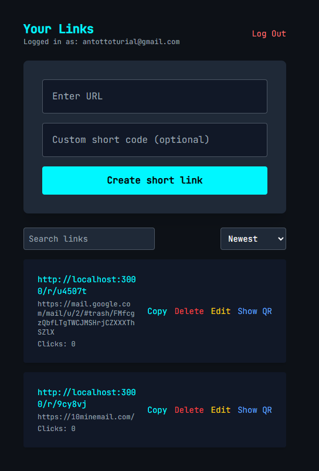
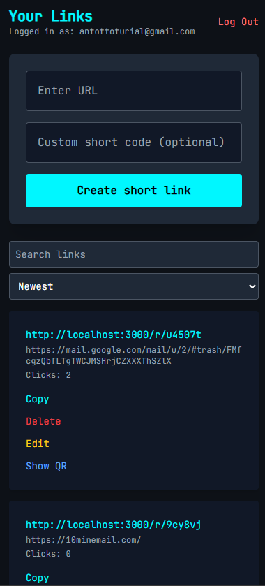

## 🔗 Smart URL Shortener

A simple, fast, and customizable URL shortener

---

### 🚀 Demo

> 🟢 Live version (on Vercel):
> [https://shorting-url-yourname.vercel.app](https://shorting-url-yourname.vercel.app)

---

### 📸 Preview

| Main Dashboard 📋                                    | Mobile Friendly 📱                                 |
| ---------------------------------------------------- | -------------------------------------------------- |
|  |  |

---

## 🧰 Features

* ✅ User registration & login (Supabase Auth)
* ✅ Shorten URLs with random or custom short codes
* ✅ View, copy, delete, and edit short links
* ✅ Realtime click count
* ✅ Show QR code for every link
* ✅ Sort links by date or click count

---

## ⚙️ Tech Stack

* ⚛️ React 19
* 🦄 Supabase (Auth + DB + Realtime)
* ⚡ Vite
* 💨 Tailwind CSS
* 🧩 TypeScript
* 🍞 react-hot-toast

---

## 📦 Installation

> 💻 Prerequisites: Node.js v18+, npm, Git

```bash
git clone https://github.com/Antot-12/Shorting-URL-.git

cd Shorting-URL-

npm install
```

---

## 🧪 Run Locally

```bash
npm run dev
```

> Then go to `http://localhost:3000` in your browser.

---

## 🛠️ Environment Variables

Create a `.env` file in the root:

```env
VITE_SUPABASE_URL=https://your-project-id.supabase.co
VITE_SUPABASE_ANON_KEY=your-public-anon-key
```

Then update `supabaseClient.ts` to use:

```ts
const SUPABASE_URL = import.meta.env.VITE_SUPABASE_URL;
const SUPABASE_ANON_KEY = import.meta.env.VITE_SUPABASE_ANON_KEY;
```

---

## ☁️ Deploy to Vercel

1. Push your project to GitHub
2. Go to [vercel.com](https://vercel.com)
3. Click **New Project**
4. Select your GitHub repo
5. In settings:

    * Framework Preset: **Vite**
    * Build Command: `npm run build`
    * Output Directory: `dist`
6. Add the same `.env` variables in Vercel dashboard
7. Click **Deploy** 🎉

---

## 📂 Folder Structure

```
src/
│
├── components/
│   ├── Auth.tsx
│   ├── LinkForm.tsx
│   ├── LinkList.tsx
│   └── ResetPassword.tsx
│
├── pages/
│   ├── Home.tsx
│   ├── Redirect.tsx
│
├── supabaseClient.ts
├── App.tsx
├── main.tsx
```

---
